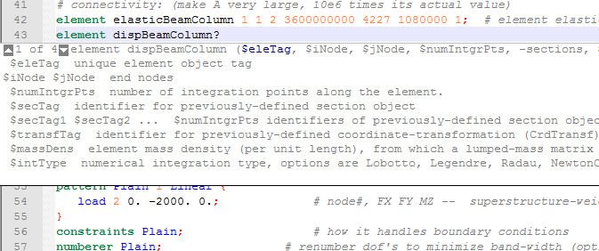

<h1>OpenSEES Autocompletion and Callhint in Notepad++</h1>

This project is helpful to those who create <a href="http://opensees.berkeley.edu">OpenSEES</a> model with Notepad++. The goal of this project is to make creating OpenSEES tcl code as easy as coding in visual studio.

<h2>Features</h2>

<ul>
<li>Style for different kinds of keywords.</li>
<li>Hint for arguments.</li>
<li>Keywords autocompletion</li>
</ul>

<h2>Screenshots</h2>

 
Coding interface
 

 
AutoCompletion
 

 
Hint 1
 

 
Hint 2
 

<h2>Installation</h2>

<ul>
<li>Download both <em>userDefineLang_opensees.xml</em> and <em>opensees.xml</em></li>
<li>Start up Notepad++, click on "Language" followed by "Define your language..."</li>
<li>Click on "Import..." button and import file <em>opensees_UserLang.xml</em>.</li>
<li>Open up the <em>plugins/APIs</em> directory in your Notepad++ installation directory and past <em>opensees.xml</em> inside</li>
<li>I highly recommend you to use with the Obsidian Theme and Enable global background color!</li>
<li>Restart Notepad++ and enjoy!</li>
</ul>

<h2>How to use</h2>

type "?" after the keyword that you want to get a hint.
